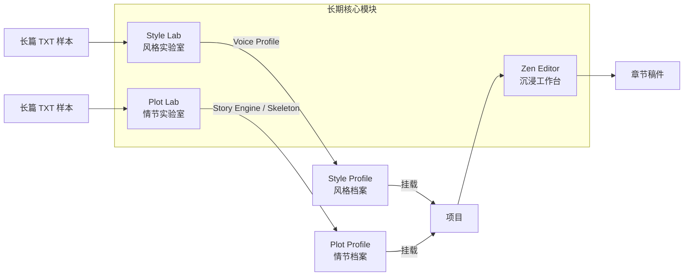
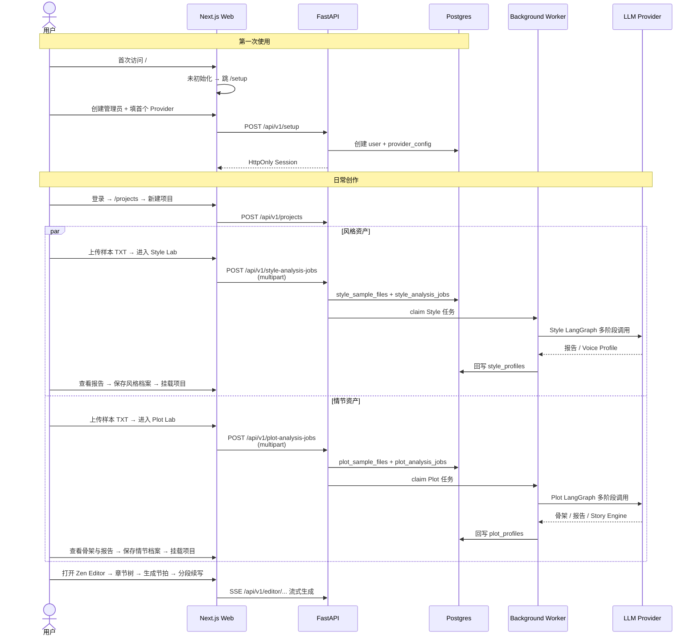

# 00 Persona 是什么

## 一句话定义

Persona 是一个**单用户、BYOK、约束式**的 AI 长篇创作平台——把大模型当成"需要审美约束的文字执行器"，而不是"黑盒生成器"。

## 目标用户

- 独立网络小说作者
- AI + 创作方向的极客用户
- 希望**完全拥有数据与模型调用链**、不愿把未完成稿件托给第三方 SaaS 的人

Persona 不是公开注册的 SaaS——首次启动会让管理员完成一次性初始化，之后所有数据都留在本机 Postgres + 本地文件系统，模型调用走用户自带的 API Key（BYOK）。

## 核心模块

Persona 由**三大长期核心模块** + **三层基础设施**构成。

### 三大长期核心模块

#### Style Lab — 风格实验室

把长篇小说样本（单个 TXT）清洗、切片、分析、聚合，反向工程出**可复用、可注入、可评估的结构化风格档案**（Style Profile）。风格档案包含两类 Markdown 产物：

- `analysis_report_markdown`：完整可审阅的分析报告（只读）
- `voice_profile_markdown`：直接注入 LLM 的 Voice Profile（可编辑）

整条分析流水线基于 **LangGraph**，支持断点续跑、并发分块、手动暂停恢复、实时增量日志。详见 [26 Style Lab](../20-domains/26-style-lab.md) 与 [27 Style Analysis 管道](../20-domains/27-style-analysis-pipeline.md)。

#### Plot Lab — 情节实验室

把长篇小说样本（单个 TXT）拆成**可复用的情节资产**：全书骨架、分析报告、Story Engine，并最终保存为可挂载到项目上的 Plot Profile。与 Style Lab 回答“怎么写”不同，Plot Lab 回答的是“讲什么、怎么推进、怎么兑现爽点”。

它同样走后台 Worker + LangGraph 流水线，但在前面多了一段 `sketch → skeleton` 的全书骨架归约，用来给后续情节分析提供全局视角。当前默认开发入口 `api/app/worker.py` 已并发接入 Style 与 Plot 两条任务通道。详见 [28 Plot Lab](../20-domains/28-plot-lab.md) 与 [29 Plot Analysis 管道](../20-domains/29-plot-analysis-pipeline.md)。

#### Zen Editor — 沉浸工作台

极简低干扰的创作白板。核心能力：

- **写作面板**：接近无干扰的编辑区，自动保存
- **圣经（Bible）面板**：世界观、角色、设定的可编辑蓝图层
- **大纲面板**：总纲 / 分卷 / 分章 / 节拍四级结构
- **节拍驱动（Beat-Driven Co-Creation）**：先生成本章 5–10 条节拍，人类确认后再逐段生成正文
- **蓝图/活态双层架构**：五个蓝图字段 + 两个运行时字段统一落在 `project_bibles`；蓝图层由作者手动维护，AI 只提议更新活态层，差异通过 Diff Dialog 人肉确认
- **双档案挂载**：项目既可挂载 Style Profile，也可挂载 Plot Profile；前者提供文风约束，后者提供情节骨架与 Story Engine，用于生成总纲、细纲等前置创作材料

详见 [22 Zen Editor](../20-domains/22-zen-editor.md)。

### 三层基础设施

1. **单用户鉴权**：`/setup` 一次性初始化（管理员账号 + 首个 Provider 配置）→ `/login` 登录 → HttpOnly Cookie Session → 所有业务资源按 `user_id` scope 隔离。详见 [14 鉴权与 Session](../10-architecture/14-auth-and-session.md)。
2. **BYOK Provider 配置中心**：OpenAI-compatible 统一配置模型，不按厂商拆原生协议。API Key 入库前加密，接口仅返回掩码，支持"测试连接"。详见 [15 LLM Provider 接入](../10-architecture/15-llm-provider-integration.md)。
3. **项目管理 CRUD**：创建、详情、编辑、归档、恢复、挂载 Style / Plot Profile、导出 txt/epub。详见 [20 项目](../20-domains/20-projects.md)。

## 典型使用路径

## 从 Go + React 背景如何建立心智

如果你熟悉 Go 后端 + React 前端，下面的类比应该能帮你快速定位：

| 你熟悉的（Go + React） | Persona 里的对应 |
| --- | --- |
| `net/http` + `chi`/`gin` | FastAPI（异步，基于 starlette，类似 aiohttp 写法） |
| `gorm` / `sqlx` | SQLAlchemy 2.0 async（`select()`、`insert().returning()`） |
| 自己写迁移 SQL | Alembic（自动生成 + 手工 review） |
| JSON 绑定 `json.Unmarshal` | Pydantic V2 Schema（`model_validate` / `model_dump`） |
| `go test` | `pytest`（`uv run pytest -q`） |
| Next.js Pages Router | **App Router**（基于目录的文件即路由，`page.tsx` / `layout.tsx` / `route.ts`） |
| Redux / Zustand | TanStack Query（服务端状态） + React 19 原生 Hooks（`useActionState` 等） |
| Server Actions 你可能不熟 | Next.js Server Actions：`'use server'` 指令，在 Server 直接被调用的 async 函数，类似"轻量 RPC"；本项目用 Server Actions 做需要人肉触发的服务端变更，复杂场景套在 TanStack Query 的 `mutationFn` 里 |

## 交付边界（MVP 现状）

截至当前版本（详见 [03 MVP 现状与 Roadmap](./03-mvp-status-and-roadmap.md)）：

- ✅ 单用户鉴权、Provider 配置、项目 CRUD —— **已完成**
- ✅ Style Lab 单 TXT 深度分析闭环（上传 → 分析 → 报告 → Voice Profile → 档案 → 挂载）—— **已完成：深度分析闭环**
- ✅ Plot Lab 单 TXT 情节分析闭环（上传 → 骨架 → 报告 → Story Engine → 档案 → 挂载）—— **已完成**
- ✅ Zen Editor 极简编辑器、AI 续写、节拍驱动、蓝图/活态双层架构、Diff 确认 —— **已完成**
- ✅ 概念抽卡（Concept Gacha）—— **已完成**
- ✅ 章节记忆同步（chapter → bible 活态层）—— **已完成**
- ✅ 项目导出 txt / epub —— **已完成**
- ⏳ 多 TXT 合并、独立证据账本、外部任务队列、Ghost Text 自动补全 —— **未开始**

## 为什么值得读完整个 wiki

1. **架构不复杂但有约束**：后端严格三层分层、前端严格 RSC/客户端边界，读懂约束比读懂代码更重要
2. **LangGraph 有生产级案例**：Style Analysis Pipeline 是完整的"state + node + map fan-out + checkpoint + worker lease"范式，可作为学习素材
3. **Prompt/Schema 强绑定**：后端的 Pydantic V2 Schema 与 Prompt 模板一一对应，改一方必须同步另一方——这是一条硬规则（见 [31 Prompt Schema 绑定](../30-prompt-engineering/31-prompt-schema-coupling.md)）
4. **Markdown-First 契约**：LangGraph 节点的 LLM 输出统一是纯 Markdown 文本，而不是 JSON，这个选择带来更好的跨模型兼容与稳定性——理由和实现细节在 [27 Style Analysis 管道](../20-domains/27-style-analysis-pipeline.md) 展开

## 下一篇

继续阅读 [01 核心痛点与产品哲学](./01-problem-and-philosophy.md)，了解 Persona 为什么要这样设计、又故意不做哪些事。
