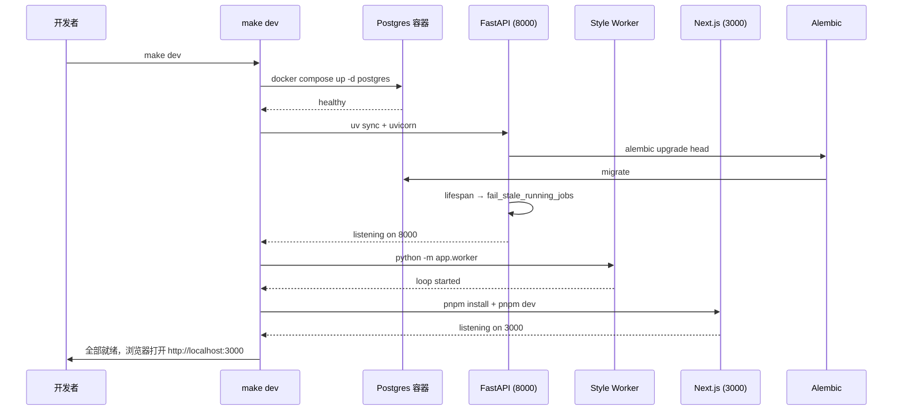

# 10 整体架构总图

## 要解决什么问题

Persona 是单用户 BYOK 的 AI 长篇创作平台。如何把"单机够用、没有运维团队、依赖外部 LLM Provider、带一条长耗时后台分析流水线"这组需求落成可运行的系统？本章给出一张权威的**进程 / 数据 / 控制流**总图，解答：

- 代码里有几个独立进程？它们怎么协作？
- 一次用户操作从 Web 到 DB 再到 LLM 经过了哪些环节？
- 为什么没有 Redis、MQ、微服务？

所有后续章节都以本图为基准坐标系。

## 系统总图

```mermaid
flowchart LR
    subgraph 用户端
        Browser[浏览器]
    end

    subgraph Next.js Web<br/>端口 3000
        RSC[Server Components<br/>+ Server Actions]
        RCC[Client Components<br/>+ TanStack Query]
        SSEClient[useStreamingText<br/>SSE 客户端]
    end

    subgraph FastAPI API 进程<br/>端口 8000
        Router[Routers<br/>/api/v1/*]
        Svc[Services]
        Repo[Repositories]
        SSEServer[SSE Endpoints]
        Lifespan[lifespan hook<br/>fail_stale_running_jobs]
    end

    subgraph Style Analysis Worker<br/>独立进程
        WorkerLoop[Worker Loop<br/>claim → lease → run]
        LangGraph[LangGraph Pipeline<br/>prepare→analyze→merge→report→summary→pack→persist]
        Checkpointer[Checkpointer<br/>SQLite/Postgres]
    end

    subgraph Postgres 容器<br/>端口 5432
        DB[(业务表 + style_* 表)]
        Ckpt[(LangGraph checkpoints)]
    end

    subgraph 本机文件系统
        Storage[PERSONA_STORAGE_DIR<br/>原始 TXT / 导出产物]
    end

    subgraph 外部
        LLM[LLM Provider<br/>OpenAI-compatible]
    end

    Browser <--> RSC
    Browser <--> RCC
    Browser <--> SSEClient
    RSC --> Router
    RCC --> Router
    SSEClient <--> SSEServer
    Router --> Svc
    Svc --> Repo
    Repo <--> DB
    Svc --> LLM
    SSEServer --> Svc
    Lifespan --> DB
    WorkerLoop --> DB
    WorkerLoop --> LangGraph
    LangGraph <--> Checkpointer
    Checkpointer --> Ckpt
    LangGraph --> LLM
    WorkerLoop --> Storage
    Svc --> Storage
```

## 关键概念与约束

### 三个独立进程

| 进程 | 职责 | 启动方式 | 日志 |
| --- | --- | --- | --- |
| **FastAPI API** | HTTP API、SSE、业务 CRUD、编辑器续写 | `uvicorn app.main:app --reload --port 8000` | `.run/api.log` |
| **Style Analysis Worker** | 后台轮询 claim 分析任务、跑 LangGraph 管道、回写结果 | `python -m app.worker` | `.run/worker.log` |
| **Next.js Web** | 前端页面、SSR、Server Actions | `pnpm dev --port 3000` | `.run/web.log` |

三者全部通过 **Postgres** 作为共享状态中枢通讯。**没有 Redis、MQ、Celery**——队列就是 `style_analysis_jobs` 表，用 `status + claimed_at + lease_expires_at` 字段做 "pending / claimed / running / stale" 状态机。

**为什么不上队列**：
- 单用户部署，并发量极低（通常 1 个分析任务排队）
- 加 Redis / Celery 运维成本高于其业务价值
- DB lease 方案足够稳、实现简单、可审计（`SELECT * FROM style_analysis_jobs` 能直接看到"谁在跑"）

参考代码：`Makefile:15`（`dev` target 串起 `db api worker web status`）、`api/app/main.py:46`（`create_app` lifespan + 路由注册）、`api/app/services/style_analysis_worker.py`（worker 主循环）。

### 启动时序



`make dev` 是开发默认入口，实现细节见 `Makefile:15-92`：
- **database 启动检测**：`docker compose ps --status running --services` 查是否已跑，避免重复启动
- **端口检测**：`lsof -iTCP:8000` / `lsof -iTCP:3000` 查端口占用，已在跑则跳过
- **依赖安装**：首次启动自动 `uv sync` / `pnpm install`
- **陈旧进程清理**：如果端口空闲但发现残留 `uvicorn`/`pnpm dev` 进程，先 `kill`

### API 进程的 lifespan

`api/app/main.py:51-62` 的 `lifespan` 上下文管理器在 FastAPI 启动时做一次性操作：

1. 构造 `StyleAnalysisWorkerService`
2. 调用 `fail_stale_running_jobs(session_factory, stale_after_seconds=settings.style_analysis_stale_timeout_seconds)` —— 把上次进程没正常退出时遗留的 `running` 任务重置回 `pending`，允许下一个 Worker 重新 claim
3. `yield` 正常服务请求
4. 关闭时 `aclose()` Worker 实例；如果 engine 是内部创建的（非测试注入），`dispose()` 连接池

**关键**：Worker 进程与 API 进程**独立进程**，但 API 进程负责恢复陈旧任务，体现"控制面（API）+ 数据面（Worker）"的角色分工。

### 路由前缀 + CORS

`api/app/main.py:114-121` 所有业务路由挂在 `/api/v1` 前缀下，8 个路由模块：

```
/api/v1/setup
/api/v1/auth
/api/v1/provider-configs
/api/v1/projects
/api/v1/project-chapters
/api/v1/editor
/api/v1/style-analysis-jobs
/api/v1/style-profiles
```

另有独立的 `GET /health` 健康检查。

CORS 白名单由 `Settings.cors_allowed_origins` 控制，默认 `["http://localhost:3000"]`。`allow_credentials=True` 使 Cookie 能跨端口传递——本地开发 3000 → 8000 必须靠这个。

### 统一异常 → JSON 响应

`api/app/main.py:69-71` 注册全局 `DomainError` handler：

```python
@app.exception_handler(DomainError)
async def handle_domain_error(_request: Request, exc: DomainError) -> JSONResponse:
    return JSONResponse(status_code=exc.status_code, content={"detail": exc.detail})
```

业务错误（资源不存在、状态不合法、权限不足等）在 service 层抛 `DomainError(status_code=..., detail="...")`，Router 无需 try/except 包裹——直接冒泡到全局 handler。详见 `api/app/core/domain_errors.py`。

### Session 工厂注入（测试友好）

`create_app(*, session_factory=None)` 的可选参数允许测试注入 mock 的 `session_factory`：

```python
# 生产路径（api/app/main.py:89-98）
engine = create_engine(settings.database_url)
session_factory = create_session_factory(engine)
app.state.engine = engine
app.state.owns_engine = True

# 测试路径
app = create_app(session_factory=mock_factory)
```

这让集成测试可以跑一个完整的 FastAPI + 真 DB（SQLite in-memory 或测试 Postgres），不需要 mock 出 HTTP 层。详见 `api/tests/conftest.py`。

### Postgres + 本地文件系统混合存储

| 数据类别 | 存放位置 | 理由 |
| --- | --- | --- |
| 业务结构化数据（users、projects、chapters、style_*） | Postgres | 关系查询、原子事务 |
| LangGraph checkpoints | Postgres（默认）或 SQLite | 断点续跑 |
| 原始 Style Lab 样本 TXT | 本机 `PERSONA_STORAGE_DIR/style-samples/` | 不走 DB，节省空间 & 便于重算 |
| 项目导出产物（临时 txt / epub） | 本机 `PERSONA_STORAGE_DIR/exports/`（或内存流式） | 下载后可删 |

`PERSONA_STORAGE_DIR` 默认 `./storage`，生产可设为绝对路径（如 `/var/lib/persona/storage`）。

### 开发兜底：SQLite

`Settings.database_url` 默认指向 Postgres，但如果 `.env` 改成 `sqlite+aiosqlite:///./persona.db`，整条链路（Alembic 迁移、async session、LangGraph checkpointer）会自动切到 SQLite。这让：
- 单机无 docker 环境也能跑
- 后端测试默认用 SQLite in-memory，跑得快
- 开发时快速切换测试数据库

**代价**：SQLite 对并发写支持差，真实工作流不推荐生产使用。

## 实现位置与扩展点

### 关键文件

| 文件 | 用途 |
| --- | --- |
| `api/app/main.py` | `create_app()` 工厂 + lifespan + 路由注册 + CORS |
| `api/app/core/config.py` | `Settings` Pydantic Settings，所有 env 变量统一入口 |
| `api/app/db/session.py` | `create_engine` / `create_session_factory` / `get_db_session` 异步 Session |
| `api/app/api/deps.py` | 所有 `Depends()` 依赖注入工厂 |
| `api/app/worker.py` | Worker 进程入口（`python -m app.worker`） |
| `web/app/layout.tsx` | 根 layout，挂 `AppProviders` |
| `web/components/app-providers.tsx` | TanStack QueryClient、Theme、错误边界 |
| `web/components/app-shell.tsx` | 主应用壳（左侧导航、顶部栏） |
| `docker-compose.yml` | Postgres 17 容器（端口 5432、volume 持久化、healthcheck） |
| `Makefile` | `dev / db / api / worker / web / status / stop` 套组 |

### 扩展点

#### 新增一个后台 worker 类型

如果未来要加 Style Generator / Chapter Indexer 等新后台进程：

1. 新建 `api/app/<domain>_worker.py`，复用 lease / 心跳范式（参考 `style_analysis_worker.py`）
2. 在 `Makefile` 加 `<domain>` target + 加入 `dev` 依赖列表
3. 在 `api/app/main.py` 的 `lifespan` 里加对应的陈旧任务恢复逻辑（如果需要）

#### 接入外部任务队列（Celery / Dramatiq）

架构允许替换 DB lease 为真正队列，但**MVP 明确不做**：
- Worker 的 `claim_pending_job()` 方法是唯一抽象点
- 接入方式：实现同样接口的 Celery-backed version，切换注入

#### 把 API 和 Worker 合并为单进程

理论可行（lifespan 里直接开一个 Worker asyncio Task），但**不推荐**：
- API 进程重启影响正在跑的分析任务
- 进程分离让 CPU 密集度高的 LangGraph 节点不会阻塞 HTTP 请求

## 常见坑 / 调试指南

### 启动不起来

| 症状 | 原因 | 修复 |
| --- | --- | --- |
| `alembic upgrade head` 失败 | Postgres 没起 / 连接串错 | `make db` 先起 DB；查 `.env` 里 `PERSONA_DATABASE_URL` |
| `ValueError: 缺少加密密钥` | `PERSONA_ENCRYPTION_KEY` 未设 | `.env` 加 `PERSONA_ENCRYPTION_KEY=<随机 32 字符串>` |
| API 8000 已在用 | 之前没 clean 退出 | `make stop-api` 或 `lsof -tiTCP:8000 \| xargs kill` |
| Web 3000 已在用 | 同上 | `make stop-web` |

### Worker 跑不起来

| 症状 | 原因 |
| --- | --- |
| `pgrep python -m app.worker` 空 | Worker 被 kill 或异常退出 |
| Worker 启动但不 claim 任务 | `PERSONA_STYLE_ANALYSIS_WORKER_ENABLED=false` 把它关了 |
| 任务卡 `running` 迟迟不结束 | 之前的 Worker crash，lease 没释放；下次 API 重启会触发 `fail_stale_running_jobs` 清理，或手动改 DB 把 status 重置 `pending` |

### SSE 断连

浏览器 tab 切到后台、网络波动、API 重启都会断开 SSE。前端 `useStreamingText` 不自动重连——需要用户重新触发。详见 [16 SSE 与流式响应](./16-sse-and-streaming.md)。

### DB 连接池用尽

`create_engine` 默认 pool_size 不大，大量并发请求会卡。单用户场景几乎遇不到；如果遇到了，调 `asyncpg` pool 参数或看是否存在 N+1。详见 [11 后端分层](./11-backend-layering.md)。

## 相关文件索引

- `api/app/main.py` — FastAPI 工厂 + lifespan
- `api/app/core/config.py` — 所有 env / Settings
- `api/app/db/session.py` — 异步 Session 工厂
- `api/app/worker.py` — Worker 进程入口
- `api/app/services/style_analysis_worker.py` — Worker 循环实现
- `api/alembic/env.py` — 迁移引擎配置
- `docker-compose.yml` — Postgres 容器定义
- `Makefile` — 开发启停脚本
- `web/app/layout.tsx` — 前端根 layout
- `web/components/app-providers.tsx` — Query Client / Theme / 边界
- `api/app/core/domain_errors.py` — 统一业务异常
- `api/.env.example` — 后端环境变量模板
- `web/.env.local.example` — 前端环境变量模板

## 相关章节

- [11 后端分层](./11-backend-layering.md) — Router / Service / Repository 三层
- [12 前端架构](./12-frontend-architecture.md) — RSC 边界与数据流
- [13 数据模型](./13-data-model.md) — Postgres 表结构
- [14 鉴权与 Session](./14-auth-and-session.md) — 单用户 setup 与 session
- [15 LLM Provider](./15-llm-provider-integration.md) — BYOK 与外部调用
- [16 SSE 与流式响应](./16-sse-and-streaming.md) — 流式通道
- [27 Style Analysis 管道](../20-domains/27-style-analysis-pipeline.md) — Worker 与 LangGraph 细节
- [40 本地开发与 Makefile](../40-operations/40-local-dev-and-make.md) — `make dev` 全套
- [42 配置与环境变量](../40-operations/42-configuration.md) — 所有 env 的展开说明
