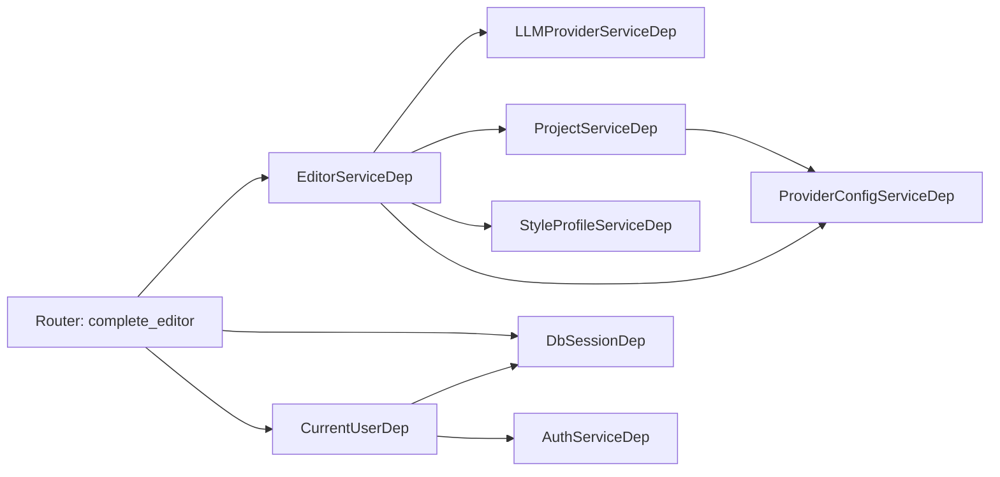

# 11 后端分层：Router / Service / Repository

## 要解决什么问题

FastAPI 天生支持"在 path function 里直接写 SQL"，初期来得快，后期必死：

- 路由签名里塞满事务控制、异常翻译、N+1 查询、权限校验、Pydantic 组装——单文件几千行
- 业务逻辑无法跨端点复用（例如"创建项目"被 setup、import、API 各调用一次）
- 测试必须走 HTTP 层，单元测试跑得又慢又脆
- LangGraph Worker 进程需要复用同一套领域逻辑，但它没有 FastAPI request 上下文

Persona 后端通过**严格三层分层 + Annotated 依赖注入**解决这些问题：

| 层 | 职责 | 不允许做的事 |
| --- | --- | --- |
| **Router** (`api/app/api/routes/`) | 解析请求、调用 Service、组装 Response Schema | 直接发 SQL、处理业务分支、跨领域组合 |
| **Service** (`api/app/services/`) | 业务编排、事务边界、调用 Repository 与其他 Service、抛 `DomainError` | 暴露 SQLAlchemy Session/Query 到调用方、写死 Response Schema |
| **Repository** (`api/app/db/repositories/`) | 与 DB 的纯粹交互（`select`/`insert`/`flush`/`delete`）、加载策略（`joinedload`/`selectinload`/`defer`） | 混入业务规则、发外部 HTTP、抛 HTTPException |

本章给出这套约束的权威样例与扩展路径。根目录 `AGENT.md` §2.1 是硬规则出处，本文是它的叙事展开。

## 关键概念与约束

### 三层分层总图

```mermaid
flowchart TD
    Client[浏览器 / Worker 进程]
    subgraph FastAPI<br/>api/app
        Router[Router<br/>api/routes/*.py]
        Deps[deps.py<br/>Annotated DI]
        Service[Service<br/>services/*.py]
        Assembler[assemblers.py<br/>可选组装函数]
        Repo[Repository<br/>db/repositories/*.py]
        Errors[core/domain_errors.py<br/>DomainError 家族]
    end
    DB[(Postgres / SQLite)]
    LLM[LLM Provider]
    FS[文件系统<br/>PERSONA_STORAGE_DIR]

    Client -->|HTTP| Router
    Router -->|调用| Service
    Router -.->|注入| Deps
    Deps -.->|产出| Service
    Service --> Repo
    Service --> Assembler
    Service -->|可选| LLM
    Service -->|可选| FS
    Repo --> DB
    Service -.->|抛出| Errors
    Errors -.->|全局 handler| Client
```

重点：**Service 是唯一的事务边界与异常源**。Router 只搬运 Pydantic 与调用 Service；Repository 对业务完全无感知。

### Router 的规约

范本：`api/app/api/routes/projects.py:1-45`。

```python
@router.get("", response_model=list[ProjectSummaryResponse])
async def list_projects(
    current_user: CurrentUserDep,
    db_session: DbSessionDep,
    project_service: ProjectServiceDep,
    include_archived: bool = Query(default=False),
    offset: int = Query(default=0, ge=0),
    limit: int = Query(default=50, ge=1),
) -> list[ProjectSummaryResponse]:
    projects = await project_service.list(
        db_session,
        user_id=current_user.id,
        include_archived=include_archived,
        offset=offset,
        limit=limit,
    )
    return [ProjectSummaryResponse.model_validate(project) for project in projects]
```

Router 里只有三件事：

1. **声明入参**：路径/查询/请求体参数 + 依赖注入（`CurrentUserDep`、`DbSessionDep`、`*ServiceDep`）
2. **一次调用**：把入参转发给 Service（通常就一行 `await service.xxx(...)`）
3. **组装响应**：用 `ResponseSchema.model_validate(...)` 把 ORM 对象转成 Pydantic（或用 `assemblers.py` 里的组合函数）

**禁止清单**（出现即反模式）：
- `session.execute(select(...))` —— SQL 应当在 Repository
- `if payload.foo == "bar": ...` 的业务分支 —— 该去 Service
- `try/except DomainError: raise HTTPException(...)` —— 全局 handler 已经在做
- 多个 Service 的串行编排 —— 封装成一个 Service 方法

### Annotated 依赖注入范式

FastAPI 推荐（`AGENT.md` §2.2 强制）的写法是用 `Annotated[..., Depends(...)]` 定义别名，再在 Router 里直接引用。集中出处：`api/app/api/deps.py`。

```python
# api/app/api/deps.py:21-22
DbSessionDep = Annotated[AsyncSession, Depends(get_db_session)]

# api/app/api/deps.py:44-56
async def get_current_user(
    request: Request,
    db_session: DbSessionDep,
    auth_service: AuthServiceDep,
) -> User:
    settings = get_settings()
    return await auth_service.resolve_user_by_token(
        db_session,
        request.cookies.get(settings.session_cookie_name),
    )

CurrentUserDep = Annotated[User, Depends(get_current_user)]

# api/app/api/deps.py:69-75
def get_project_service(
    provider_service: ProviderConfigServiceDep,
) -> ProjectService:
    return ProjectService(provider_service=provider_service)

ProjectServiceDep = Annotated[ProjectService, Depends(get_project_service)]
```

优势：

- **类型推导完整**：IDE 直接知道 `project_service` 是 `ProjectService`
- **签名紧凑**：Router 里不再是 `Depends(get_project_service)` 这种语法噪声
- **Service 间依赖显式**：`get_editor_service`（`deps.py:120-131`）以 Service 之间的依赖关系做了显式建模——`EditorService` 需要 `llm_service + project_service + style_profile_service + provider_config_service`，依赖图一眼清楚

#### 依赖链示例

`EditorServiceDep` 解析过程：



FastAPI 的 DI 容器会在一次请求内缓存同一依赖的结果，所以 `PCS` 即使被 `PS` 和 `ES` 同时需要，也只会实例化一次。

### 事务管理：两种模式

#### 模式 A：常规请求 —— `get_db_session` 托管

来自 `api/app/db/session.py:23-33`：

```python
async def get_db_session(request: Request) -> AsyncIterator[AsyncSession]:
    session_factory: async_sessionmaker[AsyncSession] = (
        request.app.state.session_factory
    )
    async with session_factory() as session:
        try:
            yield session
            await session.commit()
        except Exception:
            await session.rollback()
            raise
```

含义：

- 整个 HTTP 请求共享一个 `AsyncSession`
- 请求正常 return → 自动 `commit()`
- 抛出任何异常（包括 `DomainError`）→ 自动 `rollback()` 后继续冒泡
- Service 内部**不主动 commit**；只在需要拿到自增主键时 `await session.flush()`（参考 `ProjectRepository.create` at `api/app/db/repositories/projects.py:95-136`）

因此 Service 层的事务语义是"整个 Router 方法是一个事务"。多个 Repository 调用要么全部成功，要么全部回滚。

#### 模式 B：后台任务 —— 显式 `session_factory.begin()`

Worker 不在 HTTP request 里，拿不到 `DbSessionDep`。它直接持有 `session_factory` 并手动开事务。样例：`api/app/services/style_analysis_worker.py:85-98`。

```python
async def _claim_next_pending_job(
    self,
    session_factory: async_sessionmaker[AsyncSession],
    *,
    worker_id: str,
) -> str | None:
    settings = get_settings()
    async with session_factory.begin() as session:   # 进入时开事务，退出时自动 commit
        candidate_id = await self.job_service.claim_job_for_worker(
            session,
            worker_id=worker_id,
            max_attempts=settings.style_analysis_max_attempts,
        )
        return candidate_id
```

**`session_factory.begin()` 与 `session_factory()` 区别**：
- `session_factory()` 只开 Session，没有事务；必须显式 `commit()` 或 `rollback()`
- `session_factory.begin()` 既开 Session 又开事务；退出上下文时 `commit()`，抛错时 `rollback()`

Worker 会在不同阶段混用两种：
- **短事务**（claim 任务、写一条心跳）→ `session_factory.begin()`
- **读取型操作**（`_load_run_context`，只 select + 偶尔写元数据）→ `session_factory()` + 手动 `commit()`

这和 "Unit of Work" 模式对齐（`AGENT.md` §2.3），**禁止**在 Service 里把 `request.app.state.session_factory` 自己注入回来——依赖注入链要在 `deps.py` 里收口。

### N+1 防范三件套

#### `selectinload` —— 一对多关系

用于避免按父记录逐一查子记录。样例：`api/app/db/repositories/style_profiles.py:109-119`。

```python
stmt = (
    select(StyleProfile)
    .options(selectinload(StyleProfile.projects))  # IN 查询，不会笛卡尔积
    .where(StyleProfile.id == profile_id)
)
```

SQL 会变成：

```sql
SELECT * FROM style_profiles WHERE id = ?;
SELECT * FROM projects WHERE style_profile_id IN (?);
```

两条 query，无论 projects 有多少行。

#### `joinedload` —— 多对一/一对一关系

用于一次 `JOIN` 拉回父记录。样例：`api/app/db/repositories/projects.py:37-46`。

```python
query = (
    select(Project)
    .options(
        load_only(*_SUMMARY_COLUMNS),     # 只选需要的列，不读 inspiration/outline 等重型 Text
        joinedload(Project.provider),     # 一次 JOIN 拉 ProviderConfig
    )
    .order_by(Project.created_at.desc())
    .offset(offset)
    .limit(limit)
)
```

对应 SQL 一条：`SELECT ... FROM projects JOIN provider_configs ON ...`。

#### `raiseload('*')` —— 主动防御

在关键链路（如热路径的列表端点）加 `raiseload('*')` 可以让任何未预加载的关系访问**抛 `InvalidRequestError`**，当场暴露 N+1 风险，而不是默默多发 N 条 SQL。

**当前代码库中尚未在热路径铺开**（grep `raiseload` 未命中）。推荐在新增列表端点时主动加上，作为 N+1 的静态防线。例子：

```python
query = select(Project).options(
    raiseload("*"),                       # 任何未显式预加载的关系访问 → 抛错
    joinedload(Project.provider),
    load_only(Project.id, Project.name),
)
```

#### `load_only` + `defer` —— 减小载荷

- `load_only(*columns)`：只读这几列（其余列访问时会懒查）
- `defer(column)`：指定列延后到访问时才查

`StyleProfileRepository.list`（`api/app/db/repositories/style_profiles.py:57-73`）用 `defer` 推迟三个大 JSON 字段（每份几十 KB），列表页只查 id/title 等基础列，详情页才补读。

### `DomainError` 统一异常抛出

错误语义在 Service 抛，不在 Router 做 `raise HTTPException(...)` 翻译。全家桶在 `api/app/core/domain_errors.py`：

```python
class DomainError(Exception):
    def __init__(self, status_code: int, detail: str) -> None:
        super().__init__(detail)
        self.status_code = status_code
        self.detail = detail

class BadRequestError(DomainError): ...      # 400
class UnauthorizedError(DomainError): ...    # 401
class ForbiddenError(DomainError): ...       # 403
class NotFoundError(DomainError): ...        # 404
class ConflictError(DomainError): ...        # 409
class UnprocessableEntityError(DomainError): ...  # 422
```

注册位置：`api/app/main.py:69-71`：

```python
@app.exception_handler(DomainError)
async def handle_domain_error(_request: Request, exc: DomainError) -> JSONResponse:
    return JSONResponse(status_code=exc.status_code, content={"detail": exc.detail})
```

典型用法：`api/app/services/projects.py:43-53`。

```python
async def get_or_404(
    self,
    session: AsyncSession,
    project_id: str,
    *,
    user_id: str | None = None,
) -> Project:
    project = await self.repository.get_by_id(session, project_id, user_id=user_id)
    if project is None:
        raise NotFoundError("项目不存在")
    return project
```

**规则**：

- Service 抛 `DomainError` 子类；Router 不 `try/except`
- 全局 handler 把 `DomainError` 转为 `{"detail": "..."}` + 正确的状态码
- 未被捕获的非 `DomainError` 异常会被 FastAPI 默认处理成 500 + 堆栈日志——这符合语义（非预期错误）
- 复杂错误体（需要多字段）可以派生新子类，在 handler 里分支处理；当前项目尚无此需求

### `user_id` 横切 scope

Persona 是单用户部署，但**每一条业务资源仍然按 `user_id` 隔离**（为多用户模式留口子）。约束：

- Repository 的每个方法都接受 `*, user_id: str | None = None` 关键字参数
- Service 从 `CurrentUserDep` 传 `user_id` 进来
- Repository 在 WHERE 里追加 `.where(Model.user_id == user_id)`

对比两个 `get_by_id` 实现即可看到：

```python
# api/app/db/repositories/projects.py:77-93
async def get_by_id(self, session, project_id, *, user_id=None):
    stmt = select(Project).options(joinedload(Project.provider)).where(Project.id == project_id)
    if user_id is not None:
        stmt = stmt.where(Project.user_id == user_id)
    return await session.scalar(stmt)
```

`user_id` 是**可选的**（允许 Worker 用 None 跨用户访问），但 Router 永远从 `current_user.id` 传下来，保证 HTTP 端点不会泄漏他人数据。详见 [14 鉴权与 Session](./14-auth-and-session.md)。

### Assembler：ORM → Pydantic 的共享组装

当 Response Schema 需要多个表拼合、或在多个端点重复时，不要在 Router 里抄一遍组装代码。抽到 `api/app/api/assemblers.py`：

```python
# api/app/api/assemblers.py:70-89
def build_job_detail_response(job: StyleAnalysisJob) -> StyleAnalysisJobResponse:
    style_profile = build_style_profile_embedded_response(job.style_profile)
    return StyleAnalysisJobResponse(
        id=job.id,
        style_name=job.style_name,
        provider_id=job.provider_id,
        ...
        provider=job.provider,
        sample_file=job.sample_file,
        style_profile_id=job.style_profile_id,
        style_profile=style_profile,
    )
```

Router 只需 `return build_job_detail_response(job)`。

**位置选择**：

- 单端点用一次、纯 `model_validate(obj)` → 直接写在 Router（范本即是 `projects.py` 里的 `ProjectResponse.model_validate(project)`）
- 多端点复用 或 需要多表拼合 → 抽到 `assemblers.py`
- 带业务分支（"若 A 则拼 X，否则拼 Y"）→ 这是 Service 的活儿，不要进 assembler

## 实现位置与扩展点

### 新增一个业务领域的四件套

新增一个领域时，按这条顺序走：

1. **Model & 迁移**：先在 `api/app/db/models.py` 加模型，再生成并审查 Alembic 迁移
2. **Schema**：在 `api/app/schemas/` 定义请求 / 响应模型，使用 Pydantic V2 与 `from_attributes=True`
3. **Repository**：在 `api/app/db/repositories/` 封装 CRUD 与加载策略，签名统一按 `*, user_id=None` 收尾
4. **Service**：在 `api/app/services/` 实现业务规则、组合多个 repository / service，并只抛 `DomainError`
5. **Router**：在 `api/app/api/routes/` 暴露 HTTP 入口，只做参数解析、调用 service 和组装响应
6. **deps 注册**：在 `api/app/api/deps.py` 增加对应的 `get_xxx_service` 与 `XxxServiceDep`
7. **挂载 Router**：在 `api/app/main.py` 注册 `app.include_router(...)`
8. **测试**：补 service / repository 测试与完整接口回归

### 扩展点速查表

| 需求 | 改哪儿 |
| --- | --- |
| 新端点复用已有业务 | 加 Router method，调用已有 Service |
| 新业务分支 | 加 Service method，必要时扩 Repository |
| 新查询策略（加 `joinedload`） | Repository 内部改，对 Service 透明 |
| 新错误语义 | `core/domain_errors.py` 派生新子类 |
| 新表/字段 | `db/models.py` + `alembic revision` + Repository + Service + Schema |
| 新外部 HTTP（如新 LLM 厂商） | `services/llm_provider.py` 内部新增适配器 |

### 反模式清单

| 反模式 | 症状 | 正解 |
| --- | --- | --- |
| Router 里写 SQL | `await session.execute(select(...))` | 挪到 Repository，Service 调用 |
| Service 暴露 Session 给 Schema | `class Schema:` 的验证器里访问 `session` | 验证器应纯函数；数据加载回 Service |
| Repository 里加业务规则 | 在 `create()` 前判断 `if user.is_banned: raise` | 业务校验进 Service；Repository 只 CRUD |
| Router 翻译异常 | `try: ... except NotFoundError: raise HTTPException(404)` | 直接抛；全局 handler 处理 |
| Service 内 `session.commit()` | 破坏事务边界、和 `get_db_session` 冲突 | 只 `await session.flush()`；commit 交给 `get_db_session` |
| 多个 Service 间共享 Repository 实例 | 实例化一次、两个 Service 都依赖它 | Service 构造函数里 `repository or XxxRepository()` 各自持有；Repository 无状态 |
| Router 返回 ORM 对象 | 遇到懒加载字段会序列化出错 / 泄露字段 | 永远过一遍 `ResponseSchema.model_validate(orm_obj)` |
| `deps.py` 放业务逻辑 | "拼 Service 实例" 以外的事都越界 | deps 只组装依赖；业务进 Service |

## 常见坑 / 调试指南

### 事务相关

| 症状 | 原因 | 修复 |
| --- | --- | --- |
| 多行插入后 Router 抛异常，数据还残留 | Service 内显式 `commit()` 了 | 移除；`get_db_session` 会在异常时回滚 |
| 后台任务写库后立即读取不到 | Worker 用 `session_factory()` 没 commit | 改成 `session_factory.begin()` 或显式 `await session.commit()` |
| `session_factory.begin()` 里调 `session.commit()` 报错 | 事务已被上下文管理器接管，二次 commit 冲突 | 删除手动 commit |
| 高并发下两个 Worker 抢同一个 job | 没加锁或隔离级别不够 | 参考 `claim_job_for_worker` 的 `locked_by + locked_at` 原子更新 |

### 关系加载相关

| 症状 | 原因 | 修复 |
| --- | --- | --- |
| `MissingGreenlet` / `IO should be performed from a coroutine` | 异步 Session 在 sync 上下文访问懒加载字段 | 在 Repository 里预加载（`joinedload` 或 `selectinload`） |
| N+1 查询（日志里 SELECT 成千上万条） | 循环里访问关系属性 | 在查询 options 里加载；必要时加 `raiseload('*')` 立即暴露 |
| 列表接口慢 | 读取了几十 KB 的 Text/JSON 列 | 用 `load_only` 或 `defer` 推迟读取 |
| `Parent instance is not bound to a Session` | ORM 对象出了 Session 生命周期仍被访问 | 让 Service 在同一个 Session 内完成组装，或用 `expire_on_commit=False`（已默认启用，见 `session.py:20`） |

### DI 相关

| 症状 | 原因 | 修复 |
| --- | --- | --- |
| `DependencyException: No such dependency` | 忘了在 `deps.py` 加 `Depends(...)` 工厂 | 用 `Annotated[Xxx, Depends(get_xxx)]` 显式声明 |
| Service 构造参数错误 | `get_xxx_service` 里少传依赖 | 对照 Service `__init__` 补齐 |
| 测试里 mock 了 Service 但不生效 | 直接 patch 了类，但 deps 返回的是**实例** | 在 `app.dependency_overrides[get_xxx_service] = lambda: mock_instance` |

### 错误抛出相关

| 症状 | 原因 | 修复 |
| --- | --- | --- |
| 返回 500 而非 404 | Service 里用 `raise Exception("not found")` | 改成 `raise NotFoundError(...)` |
| 错误文案没有本地化 | `DomainError` detail 被当作 raw string | 约定 detail 为中文；多语言需要引入 i18n 层（MVP 未做） |
| 统一格式被绕过 | 有地方 `raise HTTPException(...)` | 除非是 FastAPI 内置校验（`Query(ge=0)` 等），业务错误一律走 `DomainError` |

## 相关文件索引

- `api/app/api/deps.py` — 所有 `Annotated` 依赖别名
- `api/app/api/routes/projects.py` — Router 的范本
- `api/app/services/projects.py` — Service 的范本（含 `get_or_404` / `create` / `update`）
- `api/app/db/repositories/projects.py` — Repository 的范本（含 `load_only` + `joinedload`）
- `api/app/db/repositories/style_profiles.py` — 含 `selectinload` + `defer` 的对照样例
- `api/app/db/session.py` — `get_db_session` / `create_engine` / `create_session_factory`
- `api/app/core/domain_errors.py` — `DomainError` 家族
- `api/app/main.py` — `create_app` + 全局 exception handler + Router 挂载
- `api/app/api/assemblers.py` — ORM → Pydantic 的共享组装
- `api/app/services/style_analysis_worker.py` — 后台任务的事务模式样例
- `AGENT.md` — 硬规则出处（§2.1 / §2.2 / §2.3）

## 相关章节

- [10 整体架构总图](./10-high-level-architecture.md) — 本章在系统中的坐标
- [12 前端架构](./12-frontend-architecture.md) — 调用方视角
- [13 数据模型](./13-data-model.md) — Repository 下面的表结构
- [14 鉴权与 Session](./14-auth-and-session.md) — `CurrentUserDep` 和 `user_id` scope 的来源
- [15 LLM Provider 接入](./15-llm-provider-integration.md) — Service 如何调用外部 LLM
- [27 Style Analysis 管道](../20-domains/27-style-analysis-pipeline.md) — Worker 的事务范式实战
- [50 编码规范](../50-standards/50-coding-standards.md) — 叙事向导
- 根目录 `AGENT.md` — 硬约束出处
