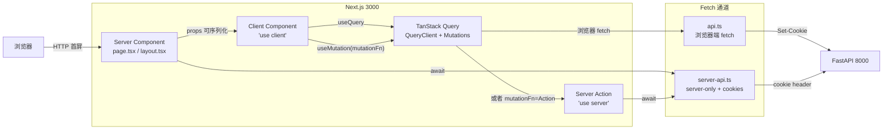
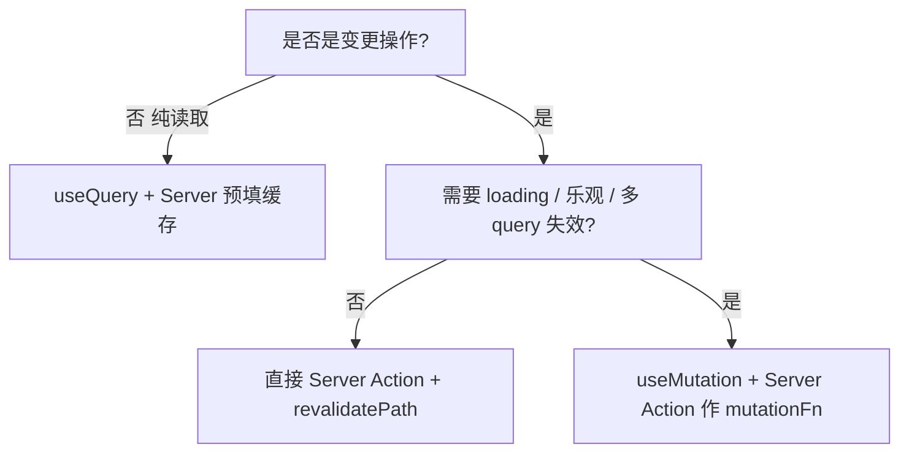

# 12 前端架构：App Router / RSC / 数据流

## 要解决什么问题

Next.js 15 App Router + React 19 把"怎么写 React 应用"重新讲了一遍：

- 页面默认是 **Server Components**（RSC），不再是 "browser 先拿到 HTML 空壳、再拉 JS 填充"
- 表单变更有三条路：**Server Actions**、**REST API**、**TanStack Query Mutation**——三者如何搭配？
- 类型契约从"后端 OpenAPI → 前端手抄 interface"要升级成"后端 OpenAPI → 生成 TS 类型"的**单一事实源**
- Cookie session 在跨端口（Next 3000 ↔ FastAPI 8000）下怎么正确透传
- 新特性 `useActionState` / `useFormStatus` / `useOptimistic` 何时用

Persona 前端用一套**明确的边界约定 + 薄 API 客户端 + TanStack Query 做缓存**把这些问题收口。本章给出边界约束、数据流、常见坑，与 `AGENT.md` §3 的硬规则对齐。

## 关键概念与约束

### 前端数据流总图



三条主要的数据到达路径：

1. **RSC 直取**（SSR）：`page.tsx` / `layout.tsx` 内 `await getServerApi()` 直接取后端数据，渲染后以 HTML + hydrated props 下发——浏览器看到的第一屏无 loading
2. **TanStack Query**（浏览器交互）：客户端组件用 `useQuery` / `useMutation` 调 `api`，承担缓存失效、乐观更新、重试
3. **Server Actions**（服务端变更）：`'use server'` 标记的函数从客户端直接调用，但在 Node 侧执行；适合"创建/修改资源 + 立即 `revalidatePath`"这类场景

### RSC 边界规则（`AGENT.md` §3.1）

| 类型 | 默认 | 何时切换 |
| --- | --- | --- |
| **Server Component** | 默认 | 取数据、读环境变量、做重计算、调用 `server-only` 文件 |
| **Client Component**（顶部 `"use client"`） | 需手动声明 | 用 `useState` / `useEffect` / 浏览器 API / 事件 handler / `useQuery` |
| **Server Action**（顶部 `"use server"` 或函数加 `"use server"`） | 需手动声明 | 写库、调用需要 cookie 的后端接口、完成后 `revalidatePath` |

#### 边界三条硬规则

1. **默认 Server、按需 Client**：不要把整棵树顶上一个 `'use client'`。`AppProviders`（客户端）是 Client；`RootLayout`（渲染 shell）是 Server，但因为子树需要 context，只能嵌 Client Wrapper 进去——参考 `web/app/layout.tsx:1-24`
2. **下放叶子**：把 `'use client'` 推到叶子组件，而不是贴在 `page.tsx` 上。越接近叶子，被水合的 JS 包越小
3. **跨边界 props 必须可序列化**：从 Server 向 Client 传的 props 不能是函数（除非是 `'use server'` 标记的 Server Action）、Class 实例、`Date`（要转 ISO 字符串）、`Promise`（除非官方 Promise 桥接）

#### `server-only` 防泄露

敏感文件顶部写 `import "server-only"`，bundler 在**试图把该文件拉进 client bundle 时会报错**。本项目的代表是 `web/lib/server-api.ts:1`：

```ts
import "server-only";
import { cookies } from "next/headers";
// ... 读取 cookie、转发到后端
```

任何从 Client Component 直接 import `server-api.ts` 的代码都编译失败——这是防止把 cookie 读取或 API Key 误带到浏览器的硬防线。

### App Router 目录约定

```
web/app/
├── layout.tsx                  # 根 layout（Server）→ 挂 AppProviders
├── page.tsx                    # 首页
├── login/page.tsx              # 登录页（未鉴权可访问）
├── setup/page.tsx              # 首次初始化向导
├── (workspace)/                # 路由分组（不影响 URL）
│   ├── layout.tsx              # 工作区 layout → 鉴权 + HydrationBoundary
│   ├── projects/
│   │   ├── page.tsx            # 项目列表
│   │   ├── actions.ts          # Server Actions（'use server'）
│   │   └── [id]/
│   │       ├── page.tsx        # 项目详情
│   │       └── editor/page.tsx # Zen Editor
│   ├── style-lab/…
│   └── settings/…
└── (marketing)/                # 可选：展示页分组
```

关键：

- **分组 `(workspace)`**：仅影响目录组织，不出现在 URL；常用于"某一组页面共享 layout"
- **`actions.ts`**：惯例文件名，Server Actions 的栖所
- **路由段和文件同名**：`projects/[id]/page.tsx` = `/projects/:id`

### 根 Layout + Providers 分工

#### `web/app/layout.tsx`（Server Component）

```tsx
// web/app/layout.tsx:13-24
export default function RootLayout({ children }: { children: React.ReactNode }) {
  return (
    <html lang="zh-CN" suppressHydrationWarning>
      <body className="font-sans">
        <AppProviders>
          {children}
          <Toaster position="top-center" />
        </AppProviders>
      </body>
    </html>
  );
}
```

Server 负责 `<html>` / `<body>` / metadata / 字体挂载；唯一的客户端 island 是 `AppProviders`。

#### `web/components/app-providers.tsx`（Client Component）

```tsx
// web/components/app-providers.tsx:1-31
"use client";

export function AppProviders({ children }: PropsWithChildren) {
  const [queryClient] = useState(
    () =>
      new QueryClient({
        defaultOptions: {
          queries: { retry: false, refetchOnWindowFocus: false },
        },
      }),
  );
  return (
    <ThemeProvider attribute="class" defaultTheme="system" enableSystem scriptProps={scriptProps}>
      <QueryClientProvider client={queryClient}>
        <TooltipProvider delayDuration={150}>{children}</TooltipProvider>
      </QueryClientProvider>
    </ThemeProvider>
  );
}
```

重点：

- `useState(() => new QueryClient())` 而不是 module-level 的 `const queryClient = new QueryClient()`——后者会在 SSR 并发请求间串台
- `retry: false` / `refetchOnWindowFocus: false` 是对单用户桌面工作流的刻意选择：重试交给 user action，窗口切换不触发重刷

### 工作区 Layout + 鉴权守卫

`web/app/(workspace)/layout.tsx:1-30` 是整个登录后区域的入口：

```tsx
export default async function WorkspaceLayout({ children }: PropsWithChildren) {
  const api = await getServerApi();
  const [setupStatus, currentUser] = await Promise.all([
    api.getSetupStatus(),
    getServerCurrentUser(),
  ]);
  if (!setupStatus.initialized) redirect("/setup");
  if (!currentUser) redirect("/login");

  const queryClient = new QueryClient();
  queryClient.setQueryData(["current-user"], currentUser);

  return (
    <HydrationBoundary state={dehydrate(queryClient)}>
      <AppShell>{children}</AppShell>
    </HydrationBoundary>
  );
}
```

干了四件事：

1. **服务端并发取**：`setupStatus` 和 `currentUser` 同时发；未初始化/未登录就 `redirect()`，根本不 render 到客户端
2. **SSR 预填 TanStack cache**：`queryClient.setQueryData(["current-user"], currentUser)`
3. **`dehydrate` + `HydrationBoundary`**：把服务端缓存状态打包下发，客户端 hydrate 时自动 pick up——浏览器端后续 `useQuery({ queryKey: ["current-user"] })` **不会再发请求**
4. **嵌入 `AppShell`**：这是一个 Client Component（`web/components/app-shell.tsx:1-49` 顶部 `"use client"`），因为要读 `usePathname` 判断是否在 `/editor` 路由下隐藏侧栏

### 三个 API 客户端的职责分工

文件职责表：

| 文件 | 运行环境 | 关键职责 |
| --- | --- | --- |
| `web/lib/api-client.ts` | 同构 | **构造 API 调用方法表**（约 300 行），以 `createApiClient(requester)` 形式接收可注入的 requester |
| `web/lib/api.ts` | 浏览器 | 薄薄一层，注入 `credentials: "include"` 的 fetch requester，导出 `api` 单例给 Client Component 使用 |
| `web/lib/server-api.ts` | 服务端（`server-only`） | 读 `cookies()` 转成 `cookie` header 手动注入 fetch，导出 `getServerApi()` / `getServerCurrentUser()` 给 RSC / Server Action 使用 |
| `web/lib/api/transport.ts` | 同构 | `createJsonRequester()` 工厂：统一处理 URL 拼接、`Content-Type` 设置（FormData 除外）、204 空响应、`text/plain` 分流、错误 detail 解析 |

#### 为什么拆三份

- **浏览器**：`credentials: "include"` 就让浏览器自动带 cookie，够用
- **服务端**：Node 里 fetch 不会自动带浏览器 cookie——必须手动从 `next/headers` 的 `cookies()` 读取，**显式**拼到 header
- **同一套 API 方法表**：`api-client.ts` 只定义"哪些方法、怎么拼路径、怎么序列化 body"，不管底层 fetch 怎么配——这让浏览器 / 服务端共用同一份契约，改一处两边生效

浏览器端（`web/lib/api.ts:1-10`）：

```ts
import { createJsonRequester } from "@/lib/api/transport";
import { createApiClient } from "./api-client";

export const API_BASE_URL = process.env.NEXT_PUBLIC_API_BASE_URL ?? "";
const request = createJsonRequester({
  baseUrl: API_BASE_URL,
  defaultInit: { credentials: "include" },
});
export const api = createApiClient(request);
```

服务端（`web/lib/server-api.ts:10-26`）：

```ts
async function getServerRequester() {
  const cookieStore = await cookies();
  const cookieHeader = cookieStore.toString();
  return createJsonRequester({
    baseUrl: API_BASE_URL,
    defaultInit: {
      cache: "no-store",
      credentials: "include",
      headers: cookieHeader ? { cookie: cookieHeader } : undefined,
    },
  });
}

export async function getServerApi() {
  const req = await getServerRequester();
  return createApiClient(req);
}
```

注意 `cache: "no-store"`——RSC 默认对 fetch 做 Next.js 级别的缓存，登录态的数据必须关掉，否则会串用户。

### Server Actions 与 TanStack Query 的协同（`AGENT.md` §3.2）

三种场景：

#### 场景 A：简单直调 Server Action

用于"点按钮 → 写库 → revalidate 页面"的纯服务端操作，不需要复杂客户端反馈。

`web/app/(workspace)/projects/actions.ts:1-20`：

```ts
"use server";

import { revalidatePath } from "next/cache";
import { getServerApi } from "@/lib/server-api";
import type { ProjectPayload } from "@/lib/types";

export async function createProjectAction(payload: ProjectPayload) {
  const api = await getServerApi();
  const project = await api.createProject(payload);
  revalidatePath("/projects");
  return project;
}

export async function updateProjectAction(id: string, payload: Partial<ProjectPayload>) {
  const api = await getServerApi();
  const project = await api.updateProject(id, payload);
  revalidatePath("/projects");
  revalidatePath(`/projects/${id}`);
  return project;
}
```

Client Component 调用时就是普通 `await createProjectAction(payload)`；Next.js 自动走 RPC 通道（POST 到内部 endpoint，在 Node 侧执行）。

#### 场景 B：用 TanStack Query 包住

需要 loading 态、错误 toast、手动失效其他 queryKey、重试，必须套在 `useMutation({ mutationFn: action })` 里。

`web/components/route-guards.tsx:12-34`（登录/首次初始化场景的样例）：

```tsx
"use client";

export function SetupPageClient() {
  const router = useRouter();
  const queryClient = useQueryClient();
  const mutation = useMutation({
    mutationFn: (payload: SetupPayload) => api.setup(payload),
    onError: (error) => toast.error(error.message),
    onSuccess: async () => {
      toast.success("系统初始化成功");
      await queryClient.invalidateQueries({ queryKey: ["setup-status"] });
      await queryClient.invalidateQueries({ queryKey: ["current-user"] });
      router.replace("/projects");
    },
  });
  return <SetupPageView onSubmit={async (v) => { await mutation.mutateAsync(v); }} submitting={mutation.isPending} />;
}
```

这里 `mutationFn` 是浏览器端 `api` 方法；如果是 Server Action 就传 `createProjectAction` 过去，用法完全一致。

#### 场景 C：Server Component 的初始数据 + 客户端交互

Server Component 取首屏数据、预填 TanStack cache（`WorkspaceLayout` 样式），Client Component 后续的刷新 / 变更走 `useQuery` / `useMutation`。

决策树：



### OpenAPI 作为单一事实源（`AGENT.md` §3.5）

路径：`web/lib/api/generated/openapi.ts` 由后端 OpenAPI schema 自动生成，`web/lib/types.ts` 从它导出所有接口类型。

`web/lib/types.ts:1-5` 摘录：

```ts
import type { components } from "@/lib/api/generated/openapi";

type OpenApiSchema<Name extends keyof components["schemas"]> = components["schemas"][Name];

export type User = OpenApiSchema<"UserResponse">;
export type ProviderConfig = OpenApiSchema<"ProviderConfigResponse">;
export type Project = OpenApiSchema<"ProjectResponse">;
```

这份文件基本只做**把 OpenAPI 的 schema 重命名到业务术语**的工作，不允许手写 interface 与接口响应结构同构重复。

#### 硬规则（禁止双轨并存）

- **禁止**：`web/lib/types.ts` 里同时有 `export interface Project { id: string; name: string }`（手写）与 `export type Project = OpenApiSchema<"ProjectResponse">`（生成）
- **允许**：纯 UI ViewModel 和展示态组合类型（无对应后端 schema），例如 `MemorySyncStatus = "checking" | "pending_review" | ...`（`web/lib/types.ts:18`）
- **允许**：用 `Omit` / `Pick` / `&` 在 OpenAPI 类型上派生新类型，例如 `ChapterMemorySyncSnapshot` + `ProjectChapterResponse` 组合成最终 `ProjectChapter`（`web/lib/types.ts:22-33`）

#### 变更流程

后端 Schema / 路由响应变更时，**严格顺序**：

1. 改后端 Pydantic + Router
2. 重新导出 OpenAPI → 更新 `web/lib/api/generated/openapi.ts`
3. 修前端引用 + 测试
4. **禁止先改前端手写类型做临时兜底**——该模式会让契约漂移，尤其容易出 optional/nullable 不一致

### React 19 新特性速查

| Hook | 用法 | 取代的旧模式 |
| --- | --- | --- |
| `useActionState(action, initial)` | 表单状态 + pending + error 三合一 | `useState(loading)` + `try/catch` 手写 |
| `useFormStatus()` | `<button>` 子组件读 `pending` | 父子组件用 prop 传 `submitting` |
| `useOptimistic(state, reducer)` | 乐观 UI 更新（发请求同时本地先更新） | 手写 before/after state |

`AGENT.md` §3.2 明确：处理表单时**优先用**这三个，不要退回 React 18 的 `useState` 样板。

当前代码里**使用 TanStack Query `useMutation` 接管**绝大多数表单 loading 态（`mutation.isPending` / `mutation.error`），因此这三个新 Hook 的直接出现不多。一旦新增一个**不需要缓存失效**的表单，优先用 `useActionState` + `useFormStatus` 组合。Server Action 内部**必须**用 Zod 二次校验入参（`AGENT.md` §3.2 末尾）。

### 样式系统（`AGENT.md` §3.3）

- **Tailwind 4 CSS-first**：在 `web/app/globals.css` 用 `@theme` 定义设计 token，代码里不硬编码 `#1f2937` 这种魔法值
- **动态类名**：用 `cn(...)` 辅助函数（`clsx` + `tailwind-merge`）拼接，避免最后的样式覆盖失效
- **复杂变体**：用 `cva(...)` 结构化定义，不在 `cn(...)` 里套三元表达式
- **基础组件**：`components/ui/` 下是 shadcn 系；业务组件写在 `components/`；不重复造 Input/Button 轮子

详见 [50 编码规范](../50-standards/50-coding-standards.md) 的前端部分。

## 实现位置与扩展点

### 关键文件速查

| 文件 | 作用 |
| --- | --- |
| `web/app/layout.tsx` | 根 layout，`<html>`/`<body>` + AppProviders |
| `web/app/(workspace)/layout.tsx` | 工作区鉴权 + SSR 预填 TanStack cache |
| `web/components/app-providers.tsx` | QueryClient + ThemeProvider + TooltipProvider |
| `web/components/app-shell.tsx` | 侧栏导航（Client，读 `usePathname`） |
| `web/components/route-guards.tsx` | 登录/初始化页面的 Client 绑定（mutation + 路由跳转） |
| `web/lib/api-client.ts` | API 方法表（约 300 行） |
| `web/lib/api.ts` | 浏览器 fetch requester + `api` 单例 |
| `web/lib/server-api.ts` | 服务端 fetch requester（`server-only` + cookies） |
| `web/lib/api/transport.ts` | `createJsonRequester` 工厂 |
| `web/lib/api/generated/openapi.ts` | OpenAPI 生成的 TS 类型（单一事实源） |
| `web/lib/types.ts` | 从 OpenAPI schema 派生的业务类型别名 |
| `web/app/(workspace)/projects/actions.ts` | Server Actions 的范本 |

### 新增一个页面的流程

以加"标签管理"页为例：

1. **路径**：`web/app/(workspace)/tags/page.tsx`（默认 Server Component）
2. **取数据**：在 `page.tsx` 里 `await getServerApi().then(a => a.getTags())`
3. **客户端交互**：若只是展示，直接渲染；若需要编辑，新建 `web/components/tags-page-view.tsx`（`'use client'`），父 Server Component 把初始数据作为 props 传入
4. **变更操作**：
   - 纯写 + `revalidatePath` → `web/app/(workspace)/tags/actions.ts` 导出 `createTagAction`
   - 需要复杂客户端反馈 → `useMutation({ mutationFn: api.createTag })` 或 `mutationFn: createTagAction`
5. **新 API 方法**：在 `web/lib/api-client.ts` 加 `getTags` / `createTag`；在 `web/lib/types.ts` 加 `export type Tag = OpenApiSchema<"TagResponse">`
6. **导航**：若要进侧栏，改 `web/components/app-shell.tsx:9-14` 的 `NAV_ITEMS`

### 新增一个 Server Action

1. 文件必须在客户端可访问的目录（通常和它服务的页面同级），例如 `app/(workspace)/xxx/actions.ts`
2. 顶部 `'use server'` 一次性声明整个文件；或每个函数前单独加也行
3. 入参是**可序列化**的（JSON 兼容）；返回值同样要能序列化
4. 写完数据后 `revalidatePath(...)` 或 `revalidateTag(...)`，否则前端 RSC 缓存不会刷新
5. **必须**在函数内用 Zod 再次 validate 入参（防客户端绕过表单校验直接构造调用）

## 常见坑 / 调试指南

### 边界相关

| 症状 | 原因 | 修复 |
| --- | --- | --- |
| `TypeError: Functions cannot be passed directly to Client Components` | Server Component 给 Client 传了非 `'use server'` 的函数 | 把函数挪到 Client Component 内部声明；或改成 Server Action |
| `Error: Text content did not match. Server: ... Client: ...` | 服务端/客户端渲染出不同结果（常见于用 `Date.now()` / `Math.random()` / 读 localStorage） | 该逻辑移到 Client + `useEffect`；或用 `suppressHydrationWarning`（只在边缘案例） |
| 修改 `'use client'` 组件却不生效 | Next cache 残留 | 停 dev → `rm -rf web/.next` → 重启 |
| `useRouter` / `usePathname` 报 "Cannot be used in a Server Component" | 在 Server Component 用了浏览器 API | 把读 `pathname` 的那块组件拆成 Client 子组件 |
| `import "server-only"` 报 "You're importing a component that needs `next/headers`" | Client Component 直接或间接 import 了 `server-api.ts` | 切断 import 路径；或把该逻辑挪到 Server Component 再 pass 数据 |

### 数据流相关

| 症状 | 原因 | 修复 |
| --- | --- | --- |
| 登录后仍被跳回 `/login` | Server Component `fetch` 缺 `cookie` header | 检查 `server-api.ts` 里 `cookies().toString()` 是否被正确注入；确保 `cache: "no-store"` |
| 浏览器端 401 | 未带 cookie | 检查 `api.ts` 的 requester 是否有 `credentials: "include"`；跨端口需要后端 `allow_credentials=True` + `allow_origins` 非通配 |
| Server Action 调用后页面不刷新 | 没 `revalidatePath` 或 path 写错 | 加上 `revalidatePath("/xxx")`；注意路径是**路由层级**（`/projects/:id`）而不是 URL |
| TanStack Query 永远 loading | RSC 预填用的 queryKey 和 Client 端用的不一致 | 两边对齐 `queryKey`（数组每一项相等） |
| `QueryClient` 数据串用户 | 多用户共享 module-level `QueryClient` | `AppProviders` 里必须 `useState(() => new QueryClient())`——实例跟组件生命周期绑定 |

### 类型契约相关

| 症状 | 原因 | 修复 |
| --- | --- | --- |
| `Property 'foo' does not exist on type 'ProjectResponse'` | 后端改了 schema 但 OpenAPI 没重生 | 重新生成 `web/lib/api/generated/openapi.ts`（通常是一个 `pnpm codegen` 脚本；若无，请补上） |
| optional / nullable 不一致导致运行时 crash | 前端定义成了 required 但后端返回 `null` | 以 OpenAPI 为准，调 Zod schema 或 UI 兜底 |
| 手写 interface 和生成类型并存 | 违反 AGENT.md §3.5 双轨禁令 | 删手写；用 `OpenApiSchema<"...">` 派生 |

### 测试相关

| 症状 | 原因 | 修复 |
| --- | --- | --- |
| `TypeError: useRouter is not a function` | `vitest` 没 mock 掉 `next/navigation` | `vi.mock("next/navigation", () => ({ useRouter: () => ({ push: vi.fn() }), usePathname: () => "/" }))` |
| Client Component 测试里访问 server-only 模块报错 | 测试环境错误 polyfill | 只 mock 业务 API，不要 import `server-api.ts` |
| Server Component 的集成测试难写 | Next.js Server Component 不能直接 render | 拆成纯函数（取数据逻辑）+ 纯展示 Client Component，各测各的 |

### 样式相关

| 症状 | 原因 | 修复 |
| --- | --- | --- |
| `bg-red-500` 显示的不是红色 | 同组件里重复类被后写的覆盖了 | 用 `cn(...)` 拼接而非 `+ " " +` 字符串 |
| 暗色主题闪烁 | `ThemeProvider` 没开 `suppressHydrationWarning` | `<html suppressHydrationWarning>` 已在 `layout.tsx` 加 |
| 任意 `className` 被 `cn` 吃掉 | `tailwind-merge` 对未知工具类保留；对 Tailwind 工具类按 variant 做冲突判定 | 自定义 class 用独立 prefix（如 `persona-xxx`）避免被误判 |

## 相关文件索引

- `web/app/layout.tsx` — 根 layout
- `web/app/(workspace)/layout.tsx` — 鉴权 + SSR 预填 + HydrationBoundary
- `web/components/app-providers.tsx` — QueryClient / Theme / Tooltip providers
- `web/components/app-shell.tsx` — 侧栏导航（Client）
- `web/components/route-guards.tsx` — 登录/初始化 Client 绑定
- `web/lib/api-client.ts` — API 方法表
- `web/lib/api.ts` — 浏览器 requester
- `web/lib/server-api.ts` — 服务端 requester（`server-only`）
- `web/lib/api/transport.ts` — `createJsonRequester`
- `web/lib/api/generated/openapi.ts` — OpenAPI 生成类型
- `web/lib/types.ts` — 业务类型派生
- `web/app/(workspace)/projects/actions.ts` — Server Actions 范本
- `AGENT.md` §3 — 前端硬规则出处

## 相关章节

- [10 整体架构总图](./10-high-level-architecture.md) — 系统坐标
- [11 后端分层](./11-backend-layering.md) — 前端调用的对端
- [13 数据模型](./13-data-model.md) — 响应类型的源头
- [14 鉴权与 Session](./14-auth-and-session.md) — Cookie 透传链路
- [16 SSE 与流式响应](./16-sse-and-streaming.md) — 流式生成的前端钩子
- [22 Zen Editor](../20-domains/22-zen-editor.md) — 前端最复杂页面的实战样本
- [50 编码规范](../50-standards/50-coding-standards.md) — 叙事向导
- 根目录 `AGENT.md` — 前端硬约束出处
