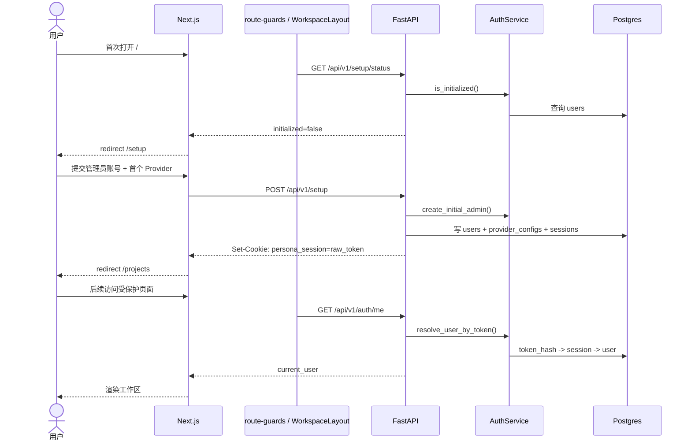

# 14 鉴权、Session 与资源隔离

## 要解决什么问题

Persona 不是公开 SaaS，而是单用户私有化工作台。鉴权层要同时解决四件事：

- 首次启动时只允许创建一次管理员账号
- 登录后用 HttpOnly Cookie 保持会话，而不是把 token 暴露给前端 JS
- 所有业务资源都天然按 `user_id` scope 隔离
- Next.js 3000 和 FastAPI 8000 跨端口协作时，Cookie 仍能正确透传

本章解释 setup、login、session 哈希、依赖注入与前端守卫的整条闭环。

## 鉴权时序

## 关键概念与约束

### 一次性 setup，不存在注册入口

初始化入口是 `api/app/api/routes/setup.py:16` 与 `api/app/api/routes/setup.py:24`：

- `GET /api/v1/setup/status` 只回答系统是否已初始化
- `POST /api/v1/setup` 会一次性完成三件事：创建管理员、创建首个 Provider、写入 Session Cookie

真正的“只能初始化一次”由 `AuthService.ensure_not_initialized()` 保证，见 `api/app/services/auth.py:50`。一旦 `users` 表里已有数据，再次 setup 会直接返回冲突错误。

### 登录与登出是标准 HttpOnly Session

登录入口在 `api/app/api/routes/auth.py:13`：

- 路由层调用 `AuthService.authenticate()` 校验用户名和密码，见 `api/app/services/auth.py:54`
- 认证成功后调用 `AuthService.create_session()` 创建一条 `sessions` 记录，见 `api/app/services/auth.py:66`
- `set_session_cookie()` 把 raw token 写入浏览器 Cookie，见 `api/app/api/deps.py:24`

登出入口在 `api/app/api/routes/auth.py:34`：

- 先从请求 Cookie 取 raw token
- Service 层按哈希删除 session 记录
- 最后返回 `delete_cookie()` 清掉浏览器端状态

`GET /api/v1/auth/me` 位于 `api/app/api/routes/auth.py:67`，本身几乎没有业务逻辑，它的意义是证明 `CurrentUserDep` 已经把认证做完。

### DB 不存 raw token，只存 HMAC 哈希

会话相关的安全原语都集中在 `api/app/core/security.py`：

- `hash_password()` / `verify_password()` 使用 Argon2，入口在 `api/app/core/security.py:18`
- `generate_session_token()` 生成浏览器持有的 raw token，入口在 `api/app/core/security.py:52`
- `hash_session_token()` 用 HMAC-SHA256 把 raw token 转成可持久化的哈希值，入口在 `api/app/core/security.py:56`
- `get_session_expiration()` 基于 `Settings.session_ttl_hours` 计算过期时间，入口在 `api/app/core/security.py:65`

这意味着：

- 浏览器拿到的是 raw token
- 数据库里只有 `token_hash`
- 即使 `sessions` 表泄露，也不能直接伪造会话

### Cookie 属性在 `deps.py` 统一收口

`api/app/api/deps.py:24` 的 `set_session_cookie()` 统一设置：

- `httponly=True`
- `samesite="lax"`
- `secure=settings.session_cookie_secure`
- `max_age=settings.session_ttl_hours * 3600`

Cookie 策略不分散在各个 Router 里，而是从一个依赖模块集中出入口，方便调整本地开发与生产行为。

### 受保护资源依赖 `CurrentUserDep`

`api/app/api/deps.py:44` 的 `get_current_user()` 是真正的认证门：

- 从请求 Cookie 取 `persona_session`
- 调用 `AuthService.resolve_user_by_token()`
- 返回 `User` ORM 对象

`api/app/api/deps.py:56` 把它包装成 `CurrentUserDep` 之后，所有业务路由都只要声明一个依赖即可自动变成“必须登录”接口。典型例子见：

- `api/app/api/routes/projects.py:29`
- `api/app/api/routes/project_chapters.py:18`
- `api/app/api/routes/style_analysis_jobs.py:26`

### `user_id` scope 是资源隔离的唯一边界

Persona 虽然是单用户产品，但后端仍然坚持所有核心业务资源带 `user_id`，并且 Router 永远把 `current_user.id` 传入 Service。代表性代码：

- `api/app/api/routes/projects.py:38`
- `api/app/services/projects.py:43`
- `api/app/db/repositories/projects.py:77`

这带来两个直接收益：

- 即使未来演进到多用户，数据库模型和 Service API 不需要推翻重来
- Worker / 脚本路径可以在必要时传 `user_id=None` 做系统级操作，而 HTTP 路径永远不会跨用户漏数据

### 前端守卫分两层：页面壳 + 提交动作

服务端工作区守卫在 `web/app/(workspace)/layout.tsx:8`：

- 先并发读取 `setupStatus` 和 `currentUser`
- 未初始化时 `redirect("/setup")`
- 未登录时 `redirect("/login")`
- 已登录则把 `current-user` 预灌入 TanStack Query cache

客户端的 setup/login 表单守卫在 `web/components/route-guards.tsx`：

- setup 成功后失效 `["setup-status"]` 与 `["current-user"]`
- login 成功后失效 `["current-user"]`
- 然后统一跳转到 `/projects`

这两层的职责不同：

- `WorkspaceLayout` 负责“没资格进入工作区时根本不渲染”
- `route-guards.tsx` 负责“提交 setup/login 后把缓存状态同步起来”

## 实现位置与扩展点

### 关键文件

| 文件 | 用途 |
| --- | --- |
| `api/app/api/routes/setup.py` | setup 状态查询与一次性初始化 |
| `api/app/api/routes/auth.py` | login / logout / delete account / me |
| `api/app/services/auth.py` | 初始化、认证、session 解析与删除 |
| `api/app/core/security.py` | 密码哈希、Session HMAC、AES-GCM |
| `api/app/api/deps.py` | `set_session_cookie()` 与 `CurrentUserDep` |
| `web/app/(workspace)/layout.tsx` | 服务端工作区守卫 |
| `web/components/route-guards.tsx` | setup/login 的客户端 mutation 包装 |
| `web/components/setup-page-view.tsx` | 初始化向导 UI |
| `web/components/login-page-view.tsx` | 登录表单 UI |
| `web/app/(workspace)/settings/account/page.tsx` | 账户页入口，负责拉取当前用户和包装退出登录 |
| `web/components/account-panel.tsx` | 登出与“注销并重置系统”入口 |

### 可扩展点

- 如果未来要支持“记住我 / 多设备 session 管理”，优先改 `sessions` 表和 `AuthService.resolve_user_by_token()`，不要把状态塞回前端 localStorage
- 如果未来要支持多用户或 RBAC，第一步也不是重写 Router，而是扩展 `CurrentUserDep` 产出的身份信息
- 如果未来要接入第三方 IdP，最小改动面仍然是 `AuthService.create_session()` 和 Cookie 写入逻辑

## 常见坑 / 调试指南

| 症状 | 常见原因 | 先看哪里 |
| --- | --- | --- |
| `/projects` 一直跳回 `/login` | Cookie 没写入、Cookie 名不匹配、CORS 未允许凭证 | `api/app/api/deps.py:24`、`api/app/main.py:75` |
| setup 提交成功但刷新后又回 `/setup` | setup 成功后没有正确失效 `setup-status` 缓存 | `web/components/route-guards.tsx` |
| 数据库里有 `sessions` 记录但 `/auth/me` 仍返回未登录 | 浏览器存的是 raw token，DB 里查的是 HMAC；确认哈希逻辑一致 | `api/app/core/security.py:56`、`api/app/services/auth.py:80` |
| 读请求频繁更新 `sessions.last_accessed_at` | `resolve_user_by_token()` 的节流逻辑被破坏 | `api/app/services/auth.py:99` |
| 本地开发登录成功但跨端口请求不带 Cookie | `session_cookie_secure=true` 或 CORS 未开 `allow_credentials` | `api/.env.example:16`、`api/app/main.py:79` |

## 相关章节

- [10 整体架构总图](./10-high-level-architecture.md) — 鉴权在全局系统中的位置
- [11 后端分层](./11-backend-layering.md) — `CurrentUserDep` 如何进入 Service
- [12 前端架构](./12-frontend-architecture.md) — Server Components 与 cookie 透传
- [13 数据模型](./13-data-model.md) — `users` / `sessions` / `user_id` scope
- [15 LLM Provider 接入](./15-llm-provider-integration.md) — setup 时同时创建首个 Provider
- [52 贡献与 Git 流程](../50-standards/52-contribution-workflow.md) — 本地验证登录链路时该跑哪些命令
