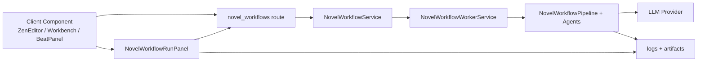

# 16 Workflow Run 与实时反馈

## 要解决什么问题

Persona 的写作体验已经从旧的“单次流式 editor 请求”迁到显式 workflow run。实时反馈现在要解决：

- 用户如何看到 AI 任务的 run 类型、状态、阶段、日志、产物和 warning
- 后端如何支持暂停、恢复、失败重试和人工断点确认
- 选区局部改写、Bible 区块生成、分卷生成、章节细纲生成、逐拍展开如何共用同一套任务协议

## 通道总图

## 关键概念与约束

### Workflow 是长期任务，不是一次 HTTP 流

入口集中在 `api/app/api/routes/novel_workflows.py`：

- `POST /api/v1/novel-workflows` 创建 run
- `GET /api/v1/novel-workflows/{id}/status` 读取状态快照
- `GET /api/v1/novel-workflows/{id}/logs` 读取增量日志
- `GET /api/v1/novel-workflows/{id}/artifacts/{name}` 读取 Markdown 产物
- `POST /api/v1/novel-workflows/{id}/pause|resume|decision` 控制暂停、恢复与人工确认

前端的旧同步式按钮仍可以通过 `web/lib/api-client.ts` 的 bridge 方法创建 run 并等待 artifact，但编辑器和工作台应优先显示 `web/components/novel-workflow-run-panel.tsx`。

### 人工断点是产品语义

`project_bootstrap` 会在 `outline_bundle` 停下，`chapter_write` 会在 `beats_markdown` 停下。用户可以：

- 查看 artifact
- 直接编辑 Markdown
- approve 继续
- revise 后继续

这些动作最终落到 `NovelWorkflowDecisionRequest`，见 `api/app/schemas/novel_workflows.py`。

### SSE 仍是底层工具，不再是编辑器主协议

`api/app/api/sse.py`、`web/lib/sse.ts` 和 `web/hooks/use-streaming-text.ts` 仍可服务需要逐字显示的功能，但 Novel Workflow 的主反馈面是“状态 + 日志 + artifact”。取消语义也从 reader cancel 变成 run pause。

## 关键文件

| 文件 | 用途 |
| --- | --- |
| `api/app/api/routes/novel_workflows.py` | workflow run HTTP API |
| `api/app/schemas/novel_workflows.py` | run / status / decision / logs / artifact 契约 |
| `api/app/services/novel_workflows.py` | run 状态机与 repository 协调 |
| `api/app/services/novel_workflow_worker.py` | 后台执行、上下文加载、Provider 调用 |
| `api/app/services/novel_workflow_pipeline.py` | LangGraph 编排、断点、artifact 写入 |
| `api/app/services/novel_workflow_agents.py` | Concept / Outline / Beat / Editor / Memory 等专职 agent |
| `web/components/novel-workflow-run-panel.tsx` | 前端 run 状态、日志、artifact、decision UI |
| `web/lib/api-client.ts` | workflow API client 与旧按钮 bridge 方法 |

## 常见坑 / 调试指南

| 症状 | 常见原因 | 先看哪里 |
| --- | --- | --- |
| UI 一直显示 running | worker 未启动或 run lease 卡住 | `api/app/services/novel_workflow_worker.py` |
| paused 但看不到确认按钮 | `checkpoint_kind` 或 artifact 名不匹配 | `web/components/novel-workflow-run-panel.tsx` |
| approve 后没有继续 | decision 的 `artifact_name` 不等于 pipeline 等待的 artifact | `NovelWorkflowPipeline._review_*` |
| artifact 为空 | pipeline 没有写入 stage artifact 或前端 artifact 名写错 | `api/app/services/novel_workflow_storage.py` |

## 相关章节

- [10 整体架构总图](./10-high-level-architecture.md) — Worker 与 API 的角色分工
- [22 Zen Editor](../20-domains/22-zen-editor.md) — 编辑器如何消费 workflow run
- [24 大纲与节拍](../20-domains/24-outline-and-beats.md) — 分卷、分章和逐拍写作
- [30 记忆同步](../20-domains/30-memory-sync.md) — Memory Sync artifact 与 Diff Dialog
