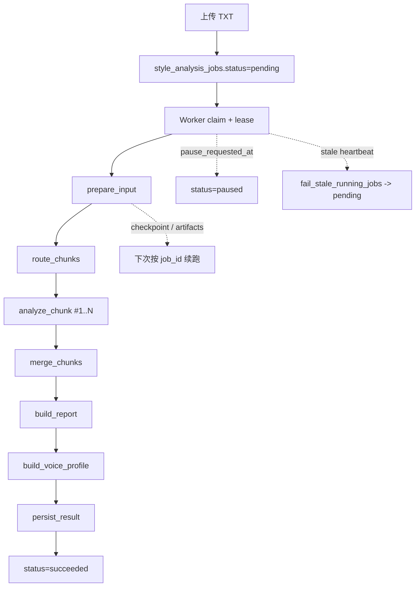

# 27 Style Analysis 管道（LangGraph）

## 一句话定义 + 价值

这是 Persona 最重的后台子系统：一个由 Worker 驱动、由 LangGraph 编排、支持 checkpoint、断点续跑、暂停恢复和任务租约的长文本风格分析流水线。

## 用户视角流程

1. 用户在 Style Lab 上传 TXT 并创建任务。
2. 任务先进入 `pending`，随后被独立 Worker claim。
3. Worker 先切片并判定文本类型，再驱动 LangGraph 逐阶段运行。
4. 前端 Wizard 轮询状态、拉取日志，并在成功后读取报告/Voice Profile。
5. 用户确认后把结果保存成 Style Profile。

## 前端入口与组件链路

这个子系统没有独立的“管道页面”，它通过 Style Lab Wizard 侧向暴露：

- `web/components/style-lab-wizard-view.tsx:18` 决定当前展示报告、摘要还是 Voice Profile
- `web/components/style-lab-wizard-report-step.tsx:15` 在运行期显示日志与阶段状态
- `web/hooks/use-style-lab-wizard-logic.ts:65` 轮询 status
- `web/hooks/use-style-lab-wizard-logic.ts:80` 增量拉取 execution logs

也就是说，前端只负责观察 job status 与读取阶段产物，真正的状态机全部在后端。

## 后端接口 / Service / Repository 链路

### 任务与产物 API

前端主要消费这些只读接口：

- `GET /style-analysis-jobs/{id}/status`，见 `api/app/api/routes/style_analysis_jobs.py:57`
- `GET /style-analysis-jobs/{id}/logs`，见 `api/app/api/routes/style_analysis_jobs.py:123`
- `GET /style-analysis-jobs/{id}/analysis-report`，见 `api/app/api/routes/style_analysis_jobs.py:152`
- `GET /style-analysis-jobs/{id}/style-summary`，见 `api/app/api/routes/style_analysis_jobs.py:166`
- `GET /style-analysis-jobs/{id}/prompt-pack`，见 `api/app/api/routes/style_analysis_jobs.py:180`

### LangGraph 主图

`api/app/services/style_analysis_pipeline.py:96` 的 `StyleAnalysisPipeline` 是主图实现，节点顺序固定：

- `prepare_input()`，见 `api/app/services/style_analysis_pipeline.py:220`
- `route_chunks()`，见 `api/app/services/style_analysis_pipeline.py:233`
- `analyze_chunk()`，见 `api/app/services/style_analysis_pipeline.py:254`
- `merge_chunks()`，见 `api/app/services/style_analysis_pipeline.py:300`
- `build_report()`，见 `api/app/services/style_analysis_pipeline.py:384`
- `build_summary()`，见 `api/app/services/style_analysis_pipeline.py:414`
- `build_prompt_pack()`，见 `api/app/services/style_analysis_pipeline.py:455`
- `persist_result()`，见 `api/app/services/style_analysis_pipeline.py:485`

`thread_id = job_id` 被写进 LangGraph config，见 `api/app/services/style_analysis_pipeline.py:169`。这保证 checkpoint 的寻址键和业务任务键完全一致。

### Worker 执行壳

`api/app/services/style_analysis_worker.py` 负责把“业务任务”包装成“可重复执行的后台作业”：

- `process_next_pending()` 是单次 poll 的入口，见 `api/app/services/style_analysis_worker.py:72`
- `_claim_next_pending_job()` 用 DB lease claim 一个任务，见 `api/app/services/style_analysis_worker.py:85`
- `_run_claimed_job()` 是真正的执行核心，见 `api/app/services/style_analysis_worker.py:105`
- `_run_stage_heartbeat_loop()` 周期性写回当前 stage，见 `api/app/services/style_analysis_worker.py:205`
- `fail_stale_running_jobs()` 在 API lifespan 启动时把陈旧任务打回 pending，见 `api/app/services/style_analysis_worker.py:413`
- `run_worker()` 是长期轮询循环，见 `api/app/services/style_analysis_worker.py:427`

### Checkpointer 与落盘产物

- Checkpointer 工厂在 `api/app/services/style_analysis_checkpointer.py:23`
- URL 归一化逻辑在 `api/app/services/style_analysis_checkpointer.py:11`
- 样本、chunk、chunk-analysis、阶段 Markdown、JSON 分类结果和日志都由 `api/app/services/style_analysis_storage.py:16` 管理
- 任务日志的增量读取在 `api/app/services/style_analysis_storage.py:198`

## 数据模型

这个领域最依赖 `StyleAnalysisJob`，定义在 `api/app/db/models.py:228`。它至少有五组关键字段：

- 身份与来源：`style_name`、`provider_id`、`model_name`、`sample_file_id`
- 状态机：`status`、`stage`
- 故障恢复：`attempt_count`、`locked_by`、`locked_at`、`last_heartbeat_at`、`pause_requested_at`、`paused_at`
- 结果载荷：`analysis_meta_payload`、`analysis_report_payload`、`voice_profile_payload`
- 生命周期：`started_at`、`completed_at`

状态常量与 stage 常量定义在 `api/app/schemas/style_analysis_jobs.py:93` 与 `api/app/schemas/style_analysis_jobs.py:99`。

## Prompt / LLM 调用要点

### 分析 Prompt 全是 Markdown-First

模板实际实现集中在 `api/app/prompts/style_analysis.py`；流水线直接从该模块导入 builder：

- `SHARED_ANALYSIS_RULES` 强制证据优先、中文 Markdown、章节顺序固定
- `STYLE_ANALYSIS_REPORT_SECTIONS` 定义固定的 3.1-3.12 结构，见 `api/app/schemas/style_analysis_jobs.py:11`
- `REPORT_TEMPLATE`、`VOICE_PROFILE_TEMPLATE` 把最终输出格式锁死

### LLM 调用有“空响应重试”和非标准字段兜底

`api/app/services/style_analysis_llm.py:87` 的 `MarkdownLLMClient` 专门为这条流水线服务：

- `build_model()` 固定 `temperature=0.0`，见 `api/app/services/style_analysis_llm.py:97`
- `ainvoke_markdown()` 会对空响应做有限重试，见 `api/app/services/style_analysis_llm.py:110`
- `_extract_markdown_text()` 允许从 `content`、`additional_kwargs.*`、`response_metadata.*` 等位置兜底提取正文，见 `api/app/services/style_analysis_llm.py:178`

### 输入判定不是 Prompt 前置，而是 worker 前置

`api/app/services/style_analysis_text.py:119` 会在真正跑图前完成：

- 编码探测
- 文本清洗
- chunk 切分
- 输入分类（章节正文 / 口语字幕 / 混合文本）

这些 classification 结果后续会直接注入 Prompt。

## LangGraph 流程图

## 关键文件索引

- `api/app/services/style_analysis_pipeline.py`
- `api/app/services/style_analysis_worker.py`
- `api/app/services/style_analysis_text.py`
- `api/app/prompts/style_analysis.py`
- `api/app/services/style_analysis_llm.py`
- `api/app/services/style_analysis_checkpointer.py`
- `api/app/services/style_analysis_storage.py`
- `api/app/services/style_analysis_jobs.py`
- `api/app/api/routes/style_analysis_jobs.py`
- `api/app/worker.py`
- `web/hooks/use-style-lab-wizard-logic.ts`
- `web/components/style-lab-wizard-report-step.tsx`

## 相关章节

- [10 整体架构总图](../10-architecture/10-high-level-architecture.md) — Worker 与 API 的角色分工
- [11 后端分层](../10-architecture/11-backend-layering.md) — Worker 的事务与 Service 组织方式
- [13 数据模型](../10-architecture/13-data-model.md) — `style_analysis_jobs` / `style_profiles`
- [26 Style Lab](./26-style-lab.md) — 管道在产品流程中的外观
- [30 Prompt 语料总览](../30-prompt-engineering/30-prompt-overview.md) — 通用 prompt 语料与生产分析 Prompt 的边界
- [32 ANALYZE-GENERATE 手法论](../30-prompt-engineering/32-analyze-generate-playbook.md) — 分析输出如何转成生成资产
